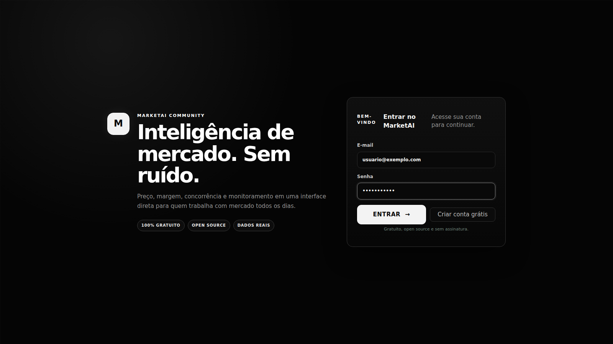
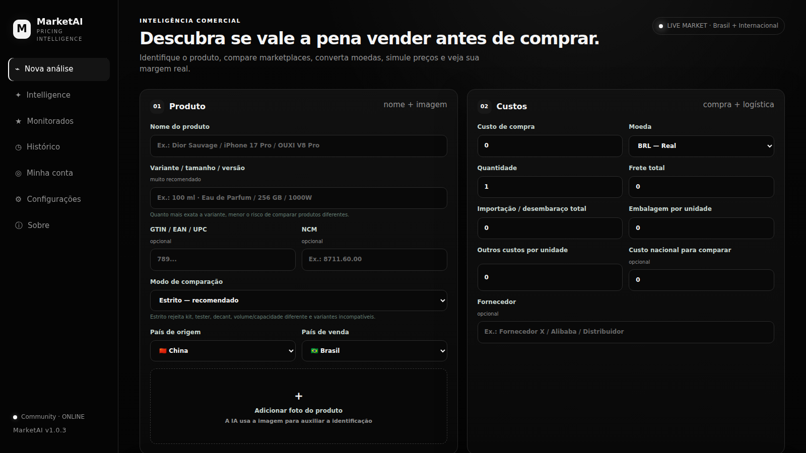
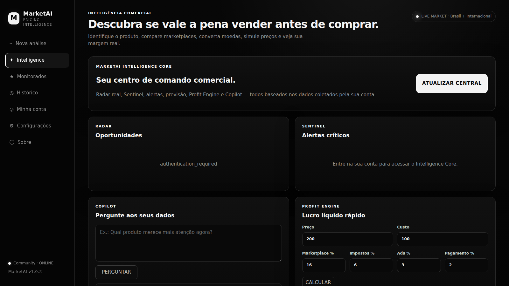
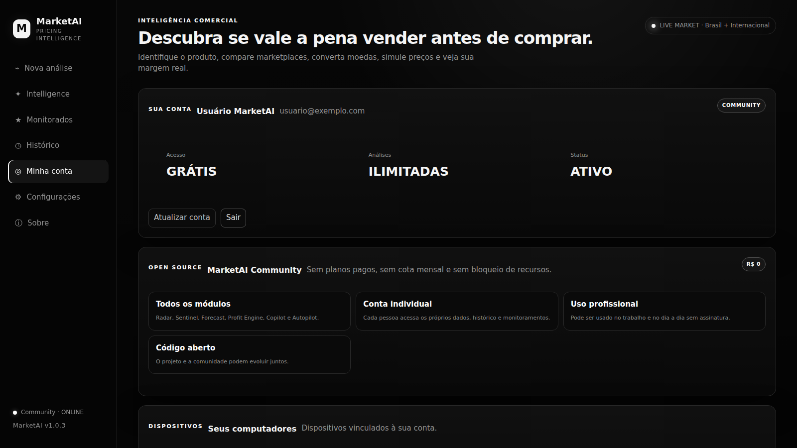
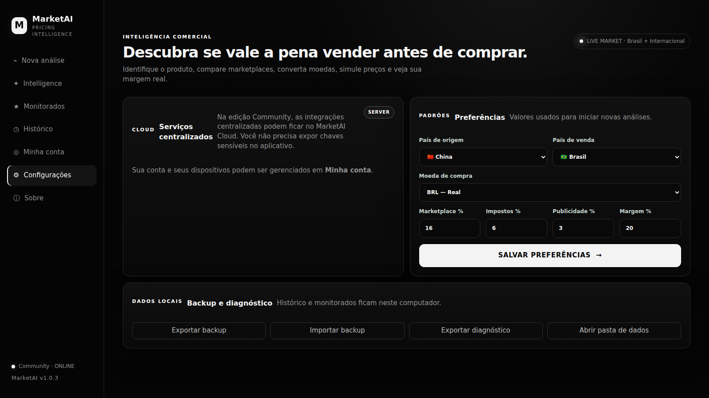

# MarketAI Community


> **Inteligência comercial gratuita e open source para quem compra, vende, pesquisa e trabalha com produtos.**

O **MarketAI Community** é um projeto gratuito e de código aberto para análise de mercado, pricing, margem, monitoramento e apoio à decisão. Cada pessoa usa sua própria conta, com dados, histórico e produtos monitorados separados.

**Não existem planos pagos, assinatura, trial, cota mensal de análises ou recursos Premium.** Todos os módulos do MarketAI são liberados para contas Community.

> **Regra de ouro:** MarketAI não fabrica preço, estoque, vendas ou tendências. Radar, Forecast e Copilot usam os dados realmente coletados pela conta. Quando a evidência não é suficiente, o sistema informa isso em vez de inventar uma resposta.

## Download para Windows

A versão atual é **v1.0.3** e os instaladores seguem o número da versão:

```text
MarketAI-Setup-v1.0.3.exe
```

Download direto da versão atual:

- [MarketAI-Setup-v1.0.3.exe](https://github.com/NyxPjct/MarketAI/releases/download/v1.0.3/MarketAI-Setup-v1.0.3.exe)
- [SHA-256](https://github.com/NyxPjct/MarketAI/releases/download/v1.0.3/MarketAI-Setup-v1.0.3.sha256)
- Release: [v1.0.3](https://github.com/NyxPjct/MarketAI/releases/tag/v1.0.3)

SHA-256:

```text
e76e9ad5167c1f6c2b803b7d86592ea98e570ee8b8e876fc97911691a835d3d7
```

Todas as versões ficam em:

https://github.com/NyxPjct/MarketAI/releases

## Login primeiro

Ao abrir o MarketAI, a primeira tela é **Entrar / Criar conta**.

A conta serve para separar análises, histórico, produtos monitorados, snapshots, alertas, configurações e o contexto usado pelo Intelligence Core.

Depois do login, o usuário entra no painel principal.

## 100% gratuito

A edição Community libera análise sem cota mensal paga, MarketAI Intelligence Core, Market Score, Data Quality Score, Profit Engine, Sentinel, Radar, Forecast, Autopilot, Copilot, alertas, histórico e múltiplos dispositivos da mesma conta.

Não existe checkout ativo na edição Community. As rotas históricas de cobrança/licença permanecem apenas por compatibilidade de código e ficam desabilitadas na experiência Community.

## Open Source

O MarketAI é distribuído sob a **Apache License 2.0**.

Isso permite estudar, usar, modificar e distribuir o software, inclusive em ambientes profissionais, respeitando os termos da licença.

Arquivos importantes:

- [LICENSE](LICENSE)
- [NOTICE](NOTICE)
- [CONTRIBUTING.md](CONTRIBUTING.md)
- [SECURITY.md](SECURITY.md)

## Screenshots — MarketAI v1.0.3

As capturas abaixo são geradas automaticamente a partir da interface atual do Desktop em **1600×900**, usando dados de demonstração apenas para preencher a apresentação visual — nenhum preço de mercado fictício é tratado como dado real.

### Login / criação de conta

A autenticação é a primeira tela do aplicativo. O visual atual usa a identidade monocromática do MarketAI Community.



### Dashboard / Nova análise

Tela principal para identificação do produto, variante, país, custos e início da análise de mercado.



### Intelligence Core

Radar, Sentinel, Copilot e Profit Engine reunidos no centro de comando comercial.



### Minha conta

Acesso Community gratuito, dados por usuário e gerenciamento de dispositivos vinculados.



### Configurações

Preferências locais, backup, privacidade e status da conexão com o MarketAI Cloud.



### Confirmação de conta criada

O cadastro usa um modal nativo do próprio design system do MarketAI, sem alertas padrão do navegador/Windows.


## Intelligence Core

**Market Score 0–100** considera qualidade da amostra, margem, folga de preço e contexto de mercado.

**Data Quality Score A–E** mostra o quanto a análise está sustentada por dados compatíveis.

**Profit Engine** calcula lucro líquido, margem líquida, ROI e break-even.

**Sentinel** mantém produtos monitorados por usuário e registra snapshots reais mesmo com o Desktop fechado quando o worker está ativo.

**Radar** ordena oportunidades a partir dos dados reais armazenados pelo Sentinel.

**Forecast** projeta comportamento com base no histórico coletado. Sem histórico suficiente, não gera tendência fictícia.

**Autopilot** calcula preços sugeridos respeitando estratégia e piso de margem.

**Copilot** responde usando o contexto real da conta. Quando IA externa não está configurada, pode operar em modo determinístico sem inventar fatos.

## Análise de produto e mercado

- identificação por nome, variante e imagem;
- GTIN/EAN/UPC opcional;
- comparação por marca, modelo e atributos;
- concentração, volume, capacidade e potência;
- rejeição de kits, amostras, decants, testers, réplicas e variantes incompatíveis quando aplicável;
- Match Score;
- separação de compatíveis, descartados e outliers;
- bloqueio de recomendação quando a amostra é insuficiente ou ambígua;
- conversão cambial;
- custo real;
- estratégias de preço;
- simulador de margem;
- histórico e exportações.

## Fontes externas

A base possui suporte para integrações como Mercado Livre/Mercado Libre, eBay, Google Shopping/SerpApi e recursos de IA.

O **MarketAI é gratuito**, mas serviços externos podem possuir suas próprias regras, credenciais, cotas ou custos. O projeto não transforma APIs pagas de terceiros em serviços gratuitos.

Credenciais sensíveis ficam no Cloud ou na instalação local configurada pelo próprio operador e não devem ser publicadas no repositório.

## Arquitetura

```text
┌──────────────────────────────┐
│     MarketAI Desktop         │
│ Windows · Login obrigatório  │
└──────────────┬───────────────┘
               │ HTTPS / JWT
               ▼
┌──────────────────────────────┐
│       MarketAI Cloud         │
│ FastAPI + autenticação       │
├──────────────────────────────┤
│ Market Engine                │
│ Intelligence Core            │
│ Sentinel Worker              │
│ Contas / dispositivos        │
│ Admin / auditoria            │
└──────────────┬───────────────┘
               │
        ┌──────┴──────┐
        ▼             ▼
   PostgreSQL     APIs externas
```

## Segurança e contas

- senhas com Argon2;
- JWT de curta duração;
- refresh tokens rotacionados e armazenados como hash;
- sessão local protegida por Windows DPAPI;
- UUID local por instalação, sem fingerprint invasivo;
- dados do Intelligence Core filtrados pelo usuário autenticado;
- secrets fora do repositório;
- .env, bancos locais, caches e tokens ignorados pelo Git;
- HTTPS obrigatório no build oficial.

## Produção Community

Instância atual do Cloud:

```text
https://marketai-cloud-production.up.railway.app
```

Health check:

```text
https://marketai-cloud-production.up.railway.app/health
```

A infraestrutura usa MarketAI Cloud + PostgreSQL + Sentinel Worker. O projeto também pode ser auto-hospedado.

## Desenvolvimento local

### Cloud

```bat
cd cloud
python -m venv .venv
.venv\Scripts\activate
pip install -r requirements.txt
copy .env.example .env
uvicorn app.main:app --reload --port 9000
```

### Sentinel Worker

```bat
cd cloud
.venv\Scripts\activate
python -m app.sentinel_worker
```

### Desktop

```bat
cd desktop
set MARKETAI_CLOUD_URL=http://127.0.0.1:9000
run_desktop_dev.bat
```

## Build Windows

O nome do instalador acompanha automaticamente a versão definida no projeto.

```text
v1.0.2 -> MarketAI-Setup-v1.0.3.exe
v1.0.3 -> MarketAI-Setup-v1.0.3.exe
v2.0.0 -> MarketAI-Setup-v2.0.0.exe
```

Build local:

```bat
cd desktop
build_installer.bat
```

## CI/CD

Em pushes e Pull Requests, o GitHub Actions executa testes Cloud/Desktop, compilação Python e validação do JavaScript.

A alteração de .release/windows.json dispara o build Windows e pode publicar:

```text
MarketAI-Setup-vX.Y.Z.exe
MarketAI-Setup-vX.Y.Z.sha256
RELEASE-NOTES.txt
```

O pipeline também suporta SHA-256, build provenance attestation, Code Signing opcional, GitHub Release automática e manifesto para auto-update.

Veja [RELEASE-PIPELINE.md](RELEASE-PIPELINE.md).

## Estrutura

```text
MarketAI/
├── cloud/
│   ├── app/
│   ├── admin/
│   ├── tests/
│   └── docker-compose.yml
├── desktop/
│   ├── backend/
│   ├── frontend/
│   ├── installer/
│   ├── tests/
│   └── docs/
├── docs/images/
├── LICENSE
├── NOTICE
├── CONTRIBUTING.md
└── SECURITY.md
```

## Filosofia do projeto

O objetivo é simples:

> criar uma ferramenta de inteligência comercial útil para estudantes, vendedores, pequenos negócios, profissionais e equipes sem colocar os recursos principais atrás de um paywall.

Contribuições são bem-vindas.

---

### MarketAI Community

**Encontrar. Entender. Precificar. Monitorar. Decidir.**
