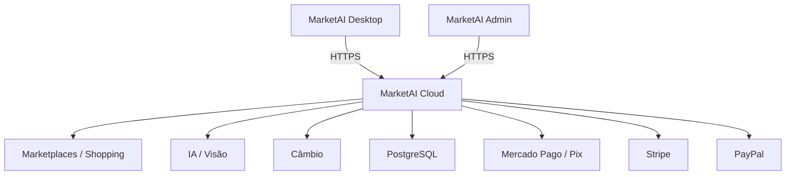

# MarketAI

[](https://github.com/NyxPjct/MarketAI/actions/workflows/bootstrap-source.yml)

> **Pricing Intelligence para descobrir se vale a pena vender antes de comprar.**

MarketAI é uma plataforma de inteligência comercial em desenvolvimento para identificar produtos, comparar preços reais de mercado, normalizar variantes, calcular custos e margens e apoiar decisões de compra e revenda.

A arquitetura atual é dividida em **MarketAI Desktop**, **MarketAI Cloud** e **MarketAI Admin**, com autenticação, planos, cotas, dispositivos, pagamentos e análise de mercado centralizada no servidor.

> [!IMPORTANT]
> Esta é a base inicial **v0.0** do projeto. O repositório não contém credenciais produtivas, instaladores compilados nem dados privados de clientes. Nunca faça commit de arquivos `.env`.

## Preview

### Interface principal


### Nova análise


### Admin Console


> Previews visuais da interface MarketAI v0.0. A aplicação continuará evoluindo neste repositório.

## O que o MarketAI faz

- identifica o produto por nome, imagem e códigos como GTIN/EAN/UPC;
- diferencia variantes como volume, concentração, capacidade e potência;
- compara anúncios reais e bloqueia recomendação quando os dados não são confiáveis;
- calcula custo real por unidade, break-even, margem, lucro e ROI;
- oferece simulador de preço e diferentes estratégias de venda;
- separa mercado nacional e internacional;
- suporta histórico, monitoramento e auditoria dos anúncios utilizados;
- centraliza as credenciais dos provedores no Cloud, sem expô-las ao cliente desktop;
- possui autenticação, trial, planos, cotas e limite de dispositivos;
- possui cobrança multi-gateway: Pix/Mercado Pago, cartão via Stripe e PayPal;
- possui Admin Console para clientes, assinaturas, pagamentos, licenças, dispositivos, planos e auditoria.

## Arquitetura



### `desktop/`

Aplicativo Windows distribuído ao cliente. O build final é preparado para gerar:

```text
MarketAI-Setup-v0.0.exe
```

O cliente faz login no Cloud e não recebe chaves dos provedores utilizados pelo servidor.

### `cloud/`

API central em FastAPI responsável por autenticação, entitlement/licenças, cotas, análise de mercado, pagamentos, webhooks, atualização do desktop e Admin Console.

## Estrutura do repositório

```text
MarketAI/
├── cloud/                 # API, billing, Admin Console e testes
│   ├── admin/
│   ├── app/
│   ├── tests/
│   └── tools/
├── desktop/               # Cliente desktop Windows
│   ├── backend/
│   ├── frontend/
│   ├── installer/
│   ├── docs/
│   └── tests/
├── docs/images/           # Screenshots usados no README
├── ADMIN-PANEL.md
├── PAYMENTS-SETUP.md
├── PRODUCTION-SETUP.md
└── LAUNCH-CHECKLIST.md
```

## Desenvolvimento local

### 1. MarketAI Cloud

No Windows:

```bat
cd cloud
python -m venv .venv
.venv\Scripts\activate
pip install -r requirements.txt
copy .env.example .env
uvicorn app.main:app --reload --port 9000
```

Edite o `.env` local com as credenciais de desenvolvimento necessárias. **Não faça commit desse arquivo.**

### 2. MarketAI Desktop

Em outro terminal:

```bat
cd desktop
set MARKETAI_CLOUD_URL=http://127.0.0.1:9000
run_desktop_dev.bat
```

## Build Windows

Antes do build comercial, defina a URL pública do MarketAI Cloud:

```bat
set MARKETAI_CLOUD_URL=https://api.seudominio.com
cd desktop
build_installer.bat
```

O pipeline foi preparado para produzir:

```text
dist-installer/MarketAI-Setup-v0.0.exe
```

A compilação do instalador deve ser feita em Windows.

## Fontes e integrações

A base possui estrutura para integrar fontes e serviços como:

- Mercado Livre;
- eBay;
- Google Shopping via provedor configurado;
- serviço de IA/visão configurado no Cloud;
- fontes de câmbio;
- Mercado Pago / Pix;
- Stripe;
- PayPal.

A disponibilidade de cada integração depende de credenciais e das regras do provedor no país selecionado.

## Princípio de confiabilidade

O MarketAI **não deve inventar preço de mercado**. Quando não existem anúncios reais compatíveis suficientes ou a variante do produto está ambígua, a recomendação de mercado é bloqueada.

Exemplos de diferenças que podem provocar descarte de um anúncio:

- `EDT` x `EDP`;
- `60 ml` x `100 ml`;
- decant, tester, amostra ou kit;
- `128 GB` x `256 GB`;
- `750 W` x `1000 W`;
- anúncios estatisticamente fora da faixa válida.

## Pagamentos

A arquitetura comercial atual prevê:

| Método | Uso principal |
|---|---|
| Pix / Mercado Pago | Brasil |
| Mercado Pago recorrente | Brasil |
| Stripe Checkout | Cartão de crédito/débito em mercados compatíveis |
| PayPal | Assinaturas em mercados compatíveis |

Detalhes de configuração e webhooks estão em [`PAYMENTS-SETUP.md`](PAYMENTS-SETUP.md).

## Administração

O Cloud inclui um Admin Console em:

```text
https://api.seudominio.com/admin
```

O painel centraliza clientes, assinaturas, pagamentos, licenças, dispositivos, planos, consumo e auditoria.

Veja [`ADMIN-PANEL.md`](ADMIN-PANEL.md).

## Produção

Antes de um lançamento público ainda é necessário configurar infraestrutura e credenciais produtivas, incluindo banco PostgreSQL, domínio HTTPS, gateways, fontes de mercado e assinatura digital do executável.

Use os documentos:

- [`PRODUCTION-SETUP.md`](PRODUCTION-SETUP.md)
- [`LAUNCH-CHECKLIST.md`](LAUNCH-CHECKLIST.md)
- [`PAYMENTS-SETUP.md`](PAYMENTS-SETUP.md)
- [`ADMIN-PANEL.md`](ADMIN-PANEL.md)

## Segurança

Entre as proteções já previstas na base:

- Argon2 para senhas;
- access token curto e refresh token rotacionado;
- tokens locais protegidos com DPAPI no Windows;
- credenciais de marketplace apenas no Cloud;
- validação de webhooks dos gateways;
- controle de dispositivos;
- licença e cotas validadas no servidor;
- auditoria das ações administrativas;
- `.env`, bancos locais, builds e logs ignorados pelo Git.

## Status

**MarketAI v0.0 — base comercial inicial.**

O projeto continuará evoluindo neste repositório.

---

Desenvolvido por **NyxPjct**.
