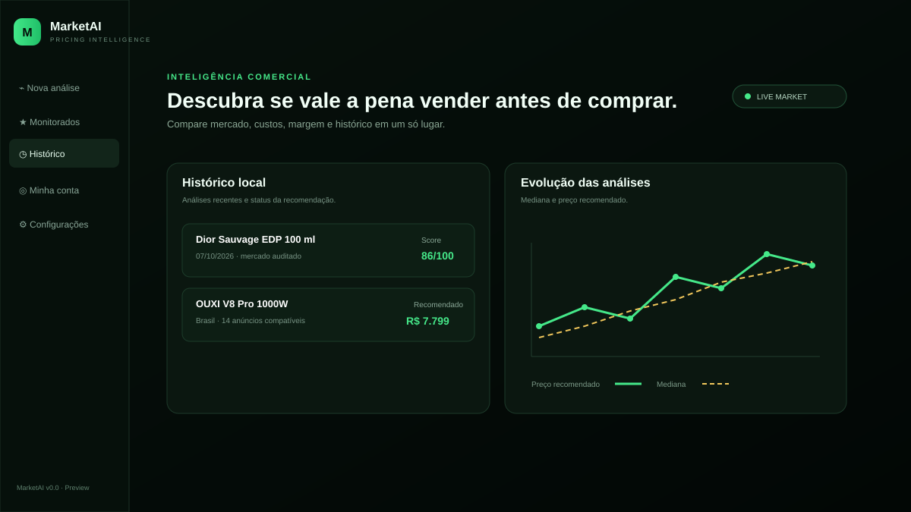
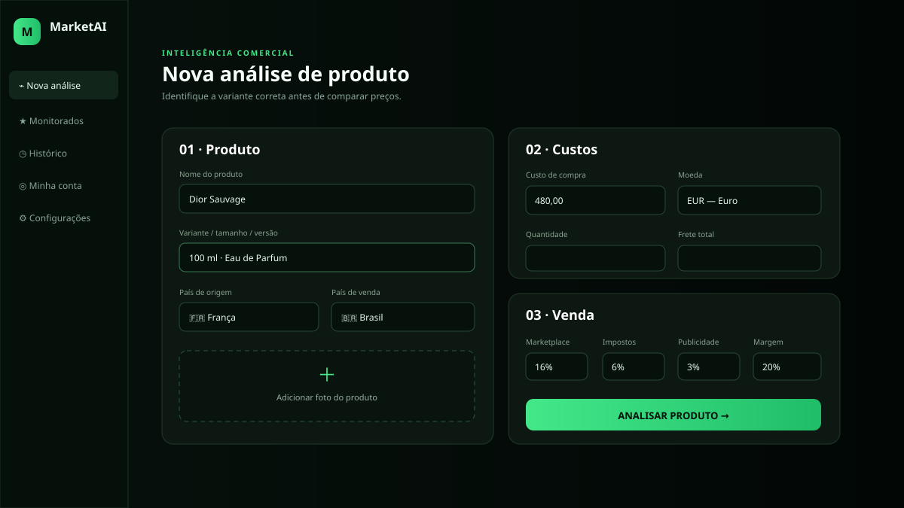
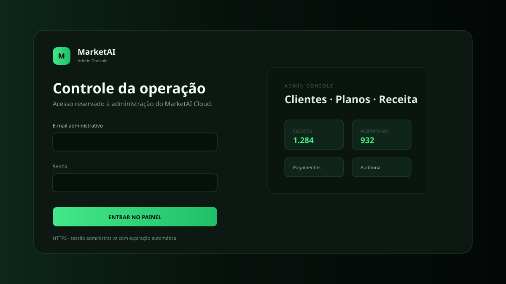

# MarketAI v1.0 SUPER FINAL


> **Inteligência comercial para e-commerce, pricing, margem, monitoramento e decisão.**

O MarketAI deixou de ser apenas um analisador de preços. A versão **v1.0 SUPER FINAL** reúne análise de mercado, cálculo financeiro, monitoramento contínuo, histórico, score proprietário, alertas, previsão e assistência por IA em uma arquitetura **Desktop + Cloud** preparada para operação comercial.

> **Regra de ouro:** MarketAI não fabrica preço, estoque, vendas ou tendências. Recursos como Radar, Forecast e Copilot dependem dos dados realmente coletados pela conta. Se a evidência não for suficiente, o sistema bloqueia a recomendação ou informa a ausência de dados.

## Preview

### Dashboard



### Nova análise



### Admin Console



## O que existe na v1.0

### MarketAI Intelligence Core

- **Market Score 0–100** — score proprietário baseado em margem, folga de preço, qualidade dos dados e profundidade da amostra.
- **Data Quality Score A–E** — mede confiabilidade da amostra, compatibilidade dos anúncios, quantidade usada e diversidade de fontes.
- **Profit Engine** — lucro líquido, margem líquida, ROI, break-even e custo variável total.
- **Sentinel** — produtos monitorados persistentes por conta, snapshots históricos e verificações automáticas.
- **Radar** — ordena oportunidades usando Market Score e momentum calculado a partir de snapshots reais.
- **Forecast** — projeções de 7, 30 e 60 períodos por regressão linear simples sobre snapshots reais.
- **Autopilot de preço** — preço sugerido respeitando estratégia e piso mínimo de margem.
- **Copilot contextual** — responde usando dados da própria conta; pode operar com IA quando configurada ou em modo determinístico sem inventar informação.
- **Central de alertas** — alertas persistentes de preço, margem e eventos relevantes do Sentinel.

### Análise de produto e mercado

- Identificação por nome, variante e dados do produto.
- Compatibilidade por marca/modelo e atributos de variante.
- Filtros para concentração de perfume, volume, capacidade, potência e condição.
- Rejeição de decants, amostras, kits, réplicas, usados/refurbished e variantes incompatíveis quando aplicável.
- Match Score por anúncio.
- Separação entre anúncios compatíveis, descartados e outliers.
- Bloqueio de recomendação quando a amostra é ambígua, insuficiente ou indisponível.
- Mercado por país e moeda.
- Conversão cambial e cálculo de custo real.
- Estratégias de preço e simulador de margem.
- Histórico e exportações.

## Fontes e integrações de mercado

A arquitetura suporta integrações de mercado no Cloud. As credenciais ficam no servidor e **nunca precisam ser distribuídas para o cliente Desktop**.

As integrações presentes na base incluem Mercado Livre/Mercado Libre, eBay e fontes adicionais configuradas no servidor. A disponibilidade de cada fonte depende das respectivas credenciais, APIs e permissões.

## MarketAI Sentinel

O Sentinel mantém uma lista de produtos monitorados por usuário e registra snapshots de mercado. O worker `cloud/app/sentinel_worker.py` pode executar ciclos automáticos no servidor mesmo quando o Desktop está fechado.

Os snapshots alimentam:

- histórico de mediana, mínimo e máximo;
- quantidade de anúncios compatíveis;
- Data Quality Score;
- Market Score;
- margem registrada;
- preço sugerido;
- Radar;
- Forecast;
- alertas;
- contexto do Copilot.

## Profit Engine

O cálculo financeiro considera:

```text
Preço de venda
- custo unitário
- custo fixo por unidade
- comissão do marketplace
- impostos
- mídia/Ads
- taxa de pagamento
- perda estimada com devoluções
= lucro líquido
```

Também retorna **margem líquida**, **ROI**, **break-even** e indicador de saúde da operação.

## Pagamentos Multi-Gateway

O MarketAI possui uma camada de cobrança por país e moeda:

| Método | Provedor | Modelo |
| --- | --- | --- |
| Pix | Mercado Pago | pagamento avulso que credita período do plano |
| Cartão de crédito/débito | Stripe Checkout | recorrente |
| PayPal | PayPal | recorrente nos mercados/moedas suportados pela conta |
| Mercado Pago | Mercado Pago | recorrente no Brasil |

Moedas comerciais padrão presentes na base incluem **BRL, USD, EUR, GBP, CAD, MXN e JPY**, com possibilidade de sobrescrever preços por variáveis de ambiente.

Consulte [`PAYMENTS-SETUP.md`](PAYMENTS-SETUP.md).

## Planos e recursos

| Plano | Preço BR padrão | Análises/mês | Dispositivos | Sentinel | Radar | Forecast | Copilot | Autopilot |
| --- | ---: | ---: | ---: | :---: | :---: | :---: | :---: | :---: |
| Essencial | R$ 49,90 | 100 | 1 | ✅ | — | — | — | — |
| Pro | R$ 99,90 | 500 | 2 | ✅ | ✅ | ✅ | ✅ | ✅ |
| Business | R$ 199,90 | 2000 | 5 | ✅ | ✅ | ✅ | ✅ | ✅ |

Limites de monitoramento atuais: **5 produtos** no Essencial, **50** no Pro e **500** no Business.

Os preços e limites podem ser alterados antes do lançamento.

## Teste grátis

A configuração padrão fornece:

- **7 dias** de teste;
- **10 análises**;
- 1 dispositivo durante o trial.

Esses valores são configuráveis por ambiente.

## Arquitetura

```text
┌───────────────────────────┐
│     MarketAI Desktop      │
│   Windows / UI comercial  │
└─────────────┬─────────────┘
              │ HTTPS / JWT
              ▼
┌───────────────────────────┐
│       MarketAI Cloud      │
│ FastAPI + autenticação    │
├───────────────────────────┤
│ Analysis / Market Engine  │
│ Intelligence Core         │
│ Sentinel Worker           │
│ Billing Multi-Gateway     │
│ Licenças / dispositivos   │
│ Admin Console / auditoria │
└─────────────┬─────────────┘
              │
       ┌──────┴──────┐
       ▼             ▼
  PostgreSQL     APIs externas
```

O Desktop mantém somente a sessão necessária. Chaves de OpenAI, marketplaces, gateways de pagamento e demais integrações comerciais permanecem no Cloud.

## Segurança

- senhas com **Argon2**;
- access token JWT de curta duração;
- refresh token aleatório persistido no servidor somente como SHA-256 e rotacionado;
- sessão local protegida por **Windows DPAPI**;
- limite de dispositivos por plano;
- credenciais de APIs mantidas exclusivamente no servidor;
- webhooks de pagamento validados/sincronizados com o provedor;
- trilha de auditoria administrativa;
- UUID local de dispositivo sem fingerprint invasivo de hardware;
- `.env`, bancos locais, caches, tokens e secrets excluídos do versionamento.

## Admin Console

O painel administrativo está disponível em:

```text
https://SEU-DOMINIO/admin
```

Ele centraliza usuários, assinaturas, pagamentos, licenças, dispositivos, consumo, planos e auditoria.

Consulte [`ADMIN-PANEL.md`](ADMIN-PANEL.md).

## API principal

Algumas rotas centrais:

```text
POST   /v1/auth/register
POST   /v1/auth/login
POST   /v1/auth/refresh
GET    /v1/account/me
POST   /v1/devices/activate
POST   /v1/licenses/activate
POST   /v1/billing/checkout
POST   /v1/analysis
GET    /v1/updates/latest

GET    /v1/intelligence/capabilities
POST   /v1/intelligence/profit
POST   /v1/intelligence/market-score
GET    /v1/intelligence/watches
POST   /v1/intelligence/watches
POST   /v1/intelligence/watches/{id}/check
GET    /v1/intelligence/watches/{id}/history
GET    /v1/intelligence/radar
GET    /v1/intelligence/alerts
GET    /v1/intelligence/forecast/{id}
POST   /v1/intelligence/copilot
```

## Estrutura do repositório

```text
MarketAI/
├── cloud/
│   ├── app/
│   │   ├── intelligence.py
│   │   ├── intelligence_engine.py
│   │   ├── sentinel_worker.py
│   │   ├── billing.py
│   │   ├── market_engine.py
│   │   └── services/
│   ├── admin/
│   ├── tests/
│   └── docker-compose.yml
├── desktop/
│   ├── backend/
│   ├── frontend/
│   ├── installer/
│   ├── tests/
│   └── docs/
├── docs/images/
├── ADMIN-PANEL.md
├── PAYMENTS-SETUP.md
├── PRODUCTION-SETUP.md
├── LAUNCH-CHECKLIST.md
└── SUPER-FINAL-v1.0.md
```

## Desenvolvimento local

### Cloud

```bat
cd cloud
python -m venv .venv
.venv\Scripts\activate
pip install -r requirements.txt
copy .env.example .env
uvicorn app.main:app --reload --port 9000
```

### Sentinel Worker

Em outro terminal:

```bat
cd cloud
.venv\Scripts\activate
python -m app.sentinel_worker
```

### Desktop

```bat
cd desktop
set MARKETAI_CLOUD_URL=http://127.0.0.1:9000
run_desktop_dev.bat
```

## Produção

A base está preparada para separar aplicativo e serviços sensíveis. Antes de vender publicamente ainda é necessário configurar infraestrutura produtiva: domínio HTTPS, PostgreSQL, gateways reais, APIs de mercado, secrets, política comercial e assinatura de código Windows.

Veja:

- [`PRODUCTION-SETUP.md`](PRODUCTION-SETUP.md)
- [`PAYMENTS-SETUP.md`](PAYMENTS-SETUP.md)
- [`ADMIN-PANEL.md`](ADMIN-PANEL.md)
- [`LAUNCH-CHECKLIST.md`](LAUNCH-CHECKLIST.md)

## Build do Windows

O projeto continua configurado para gerar o instalador comercial definido para esta linha:

```text
MarketAI-Setup-v0.0.exe
```

O software internamente está identificado como **MarketAI v1.0 SUPER FINAL**. O build final do `.exe`/instalador deve ser executado em Windows com as dependências descritas no projeto.

```bat
build_desktop_installer.bat
```

## Testes da SUPER FINAL

Na preparação desta versão foram validados:

- suíte Cloud;
- suíte Desktop;
- Intelligence Engine;
- pagamentos multi-gateway;
- painel administrativo;
- matching de produto;
- pricing;
- sintaxe JavaScript;
- compilação Python.

## CI/CD e Releases

O repositório possui pipeline de qualidade e distribuição para Windows:

- **MarketAI CI** roda em pushes e Pull Requests para `main`, validando testes Cloud/Desktop, compilação Python e sintaxe do frontend.
- **Windows Build & Release** gera `MarketAI-Setup-v0.0.exe` em runner Windows, verifica SHA-256 e publica artifact.
- Tags `v*` podem gerar **GitHub Release automática** com instalador e checksum.
- O build comercial exige uma **URL HTTPS real do MarketAI Cloud**; localhost é bloqueado em modo de release.
- O pipeline suporta **Code Signing opcional** com certificado PFX armazenado apenas em GitHub Actions Secrets.
- Cada instalador recebe **build provenance attestation**.
- Após um release, o pipeline tenta publicar o manifesto `cloud/releases/windows-stable.json` usado pelo atualizador do Desktop.

Para releases por tag, configure a variável do repositório `MARKETAI_CLOUD_URL`. Para assinatura digital, configure os secrets `MARKETAI_SIGN_PFX_BASE64` e `MARKETAI_SIGN_PASSWORD`.

Consulte [`RELEASE-PIPELINE.md`](RELEASE-PIPELINE.md).

## Status

**MarketAI v1.0 SUPER FINAL — desenvolvimento comercial / preparação de produção.**

O código já contém a arquitetura e os módulos centrais da edição comercial. Serviços externos só operam de forma real quando as respectivas credenciais e infraestrutura produtiva são configuradas.

---

### MarketAI

**Encontrar. Entender. Precificar. Monitorar. Decidir.**
